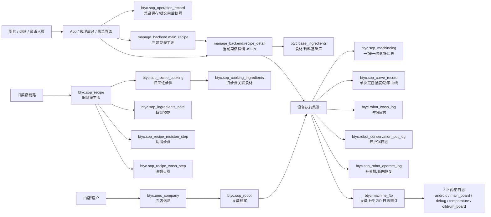
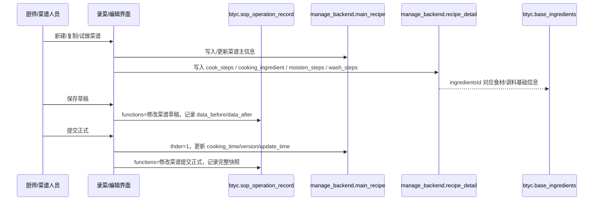
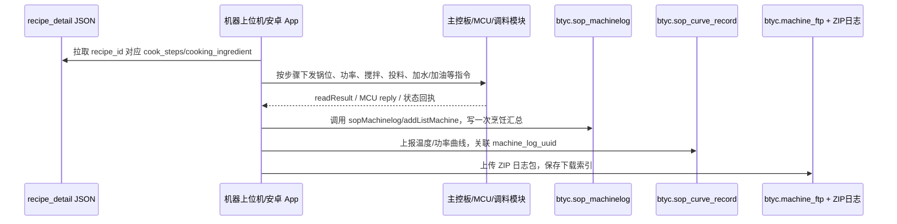

# 业务数据流转结构图与字段定位（2026-05-29 快速版）

> 目的：给产品、研发、数据和后续接手团队快速恢复“录菜”和“机器执行菜谱”两条核心链路的数据库地图。
> 口径：本文件基于 2026-05-29 直接读取公司只读 MySQL 源库、字段注释、样例数据和一个真实设备日志包整理；没有依赖原始业务代码。

## 0. 只读库连通性与本次取证范围

已确认公司只读库可读，数据库版本为 `8.0.22-txsql`。

本次看到的主要 schema：

| Schema | 表数 | 本次用途 |
|---|---:|---|
| `btyc` | 286 | 设备、门店、老菜谱表、生产日志、日志文件、故障/清洗/设备状态 |
| `manage_backend` | 18 | 当前管理后台菜谱主数据、菜谱 JSON 详情、工程模式操作记录 |
| `btyc_statics` | 7 | 日/门店/设备统计宽表 |
| `dev_btyc` | 278 | 测试/开发链路，含 Perspect/带眼镜录菜实验表 |
| `schedule` / `schedule2` | 25 / 23 | 调度相关，暂未进入本次主链路 |

重要提醒：

- `btyc.sop_machinelog` 约 2926 万行，`btyc.machine_ftp` 约 113 万行，`btyc.robot_wash_log` 约 1982 万行，不能全表扫。
- 当前新菜谱高 ID 主要在 `manage_backend.main_recipe` + `manage_backend.recipe_detail`；老链路 `btyc.sop_recipe` + `btyc.sop_recipe_cooking` + `btyc.sop_cooking_ingredients` 仍保存旧菜谱和部分历史数据。
- 下面的“字段流转”是基于数据库结构、字段注释和样例数据的工程推断；最终写入点应以后端服务代码或 App 代码为准。

## 1. 总体数据结构框图

## 2. 场景一：录菜 / 试菜 / 菜谱提交

### 2.1 录菜链路的一句话

厨师每次录菜、改菜或试菜，本质上会形成一份“菜谱主数据 + 详细步骤 JSON + 操作前后快照”；草稿和正式状态通过 `thder` 区分，用户录制菜谱通过 `threcupe=1` 标记，派生/复制通过 `parent_id`、`parentid`、`acpfo` 等字段追溯。

### 2.2 录菜流程框图

### 2.3 当前主链路表

#### `manage_backend.main_recipe`：当前菜谱主表

定位：每个菜谱一行，保存菜谱身份、归属、状态、版本、总时长、分量等主字段。

核心字段：

| 字段 | 含义 |
|---|---|
| `id` | 菜谱 ID，执行日志中的 `recipe_id` 会关联到这里 |
| `name` / `group_name` | 菜谱名 / 标准菜名 |
| `type` | 菜谱类型：0 官方，1 官方多版本，2 官方定制，3 用户菜谱，4 隐藏，8 口味分量衍生，9 omni |
| `thder` | 状态：0 草稿，1 标准菜谱 |
| `threcupe` | 标记录制菜谱，1 为用户自创建/录制菜谱 |
| `shop_id` | 所属门店，对应门店/客户维度 |
| `corporation_id` | 所属企业 |
| `user_id` | 所属个人，0 通常表示共享/非个人私有 |
| `parent_id` | 来源/父菜谱，用于追溯复制、派生、试菜版本 |
| `cooking_time` | 烹饪总时长，秒 |
| `pot_type` / `power_type` / `max_power` | 锅型、功率类型、最大功率 |
| `apply_moisten_pot` | 是否应用润锅程序 |
| `ingredients_total_dosage` | 菜谱用料总重量 |
| `create_time` / `update_time` / `latest_cook_time` / `cook_times` | 创建、更新、最近烹饪、成功次数 |

样例：`recipe_id=232644`，`张氏肉丝1份`，`type=3`，`thder=1`，`threcupe=1`，`cooking_time=72`，2026-05-29 创建/提交。

#### `manage_backend.recipe_detail`：当前菜谱详情 JSON

定位：当前最重要的“每一步怎么做”的落点。

| 字段 | 含义 |
|---|---|
| `recipe_id` | 对应 `main_recipe.id` |
| `cook_time` | 烹饪总时长 |
| `cook_steps` | 烹饪步骤数组，包含锅动作、食材/调料投放、提醒等 |
| `cooking_ingredient` | 全部投料/配料明细数组 |
| `moisten_steps` | 润锅步骤 |
| `wash_steps` | 洗锅步骤 |
| `temperature_curve` | 温度曲线配置 |
| `serve_note` | 出菜须知 |
| `ingredient_note` | 备菜须知 |
| `initial_temperature` / `initial_temperature_array` | 初始温度配置 |
| `crc` | 校验码 |

`cook_steps` 单步常见字段：

| 字段 | 含义 |
|---|---|
| `time` | 步骤时间点，秒 |
| `type` | 步骤类型：旧表注释为 1 食材、2 调料、3 锅、4 操作提醒 |
| `commands` | 可读的执行内容，如“锅设置为 8000W, 慢速, 低锅位”或“菜籽油 70.0g” |
| `power` | 加热功率 |
| `speed` | 转速/搅拌速度 |
| `direction` | 方向 |
| `position` | 锅位 |
| `automatic` | 0 手动，1 自动 |
| `movepot` | 是否移锅 |
| `stir` / `stirMode` / `stirSpeed` | 搅拌相关 |
| `initialTemperature` / `initialTemperatureArray` | 该步初始温度 |
| `thedofTime` | 结束时间字段 |

`cooking_ingredient` 常见字段：

| 字段 | 含义 |
|---|---|
| `ingredientsId` | 食材/调料 ID，关联 `btyc.base_ingredients.ingredinent_id` |
| `ingredientsDosage` | 用量 |
| `ingredientsUnit` | 单位，如 g、克 |
| `cookingId` | 关联具体步骤 |
| `insideand` | 1 详情展示，0 编辑流程展示 |
| `feedingMode` | 投料方式相关字段 |
| `position` | 投料位置 |
| `ingredientsTodyw` | 处理方式 |

真实样例：`recipe_id=232644` 的 `recipe_detail` 中，`cook_steps=13` 条，`cooking_ingredient=9` 条，`moisten_steps=1` 条。第一步为锅动作：`type=3`、`power=4000`、`speed=6`、`position=2`、`commands=锅设置为4000W,慢速,低锅位`。

#### `btyc.sop_operation_record`：菜谱编辑/提交审计快照

定位：最适合复原“厨师一次一次试、每次改了什么”的表。

核心字段：

| 字段 | 含义 |
|---|---|
| `id` | 操作记录 ID |
| `owner` | 操作用户 |
| `company_id` | 操作门店 |
| `recipe_id` | 被操作菜谱 |
| `functions` | 操作功能，如 `修改菜谱草稿`、`修改菜谱提交正式` |
| `data_before` | 操作前完整 JSON |
| `data_after` | 操作后完整 JSON |
| `change_notes` | 调整原因 |
| `type` | 1 旧版本操作日志，2 新版本操作日志 |
| `create_time` | 操作时间 |

`data_after` 的主要 JSON key：

- `sopRecipeBasicInfo`：菜谱基础信息，对应 `main_recipe` 主字段。
- `sopRecipeCookingParamList`：每一步烹饪参数列表，里面还能嵌套 `cookingIngredientsParamList`。
- `recipeMoistenStepConfig`：润锅油量、温度、转锅时间。
- `recipeHeatStepConfig`：初始温度。
- `sopRecipeIngredientsInfo`：备菜、用料、完成说明等。
- `sopRecipeDescInfo`：标签、关联菜谱、标准名等描述信息。
- `isNeedValidate`：是否需要校验。

真实样例：`id=413100`、`recipe_id=232644`、`functions=修改菜谱提交正式`、`create_time=2026-05-29 12:08:02`，`data_after` 里包含 `sopRecipeBasicInfo`、`sopRecipeCookingParamList=13` 条、`recipeMoistenStepConfig` 等完整结构。

### 2.4 旧链路表

当前高 ID 新菜谱只在 `manage_backend` 中存在；旧菜谱在 `btyc` 老表中仍有结构化行。

| 表 | 作用 |
|---|---|
| `btyc.sop_recipe` | 老菜谱主表，字段与 `main_recipe` 高度相似，包含 `type/thder/threcupe/sn/parentid/acpfo/cooking_time` |
| `btyc.sop_recipe_cooking` | 老烹饪步骤表，一步一行，字段包括 `recipe_id/commands/time/type/power/speed/direction/position/automatic/movepot/stir/initial_temperature` |
| `btyc.sop_cooking_ingredients` | 老步骤关联食材表，字段包括 `recipe_id/cooking_id/Ingredients_id/Ingredients_dosage/Ingredients_unit` |
| `btyc.sop_lngredients_note` | 备菜预制 |
| `btyc.sop_recipe_moisten_step` | 润锅步骤 |
| `btyc.sop_recipe_wash_step` | 洗锅步骤 |
| `btyc.sop_cooking_curve` | 菜谱/单次关联温度曲线，含 `machine_log_uuid` |

验证样例：`recipe_id=118869` 同时存在于 `btyc.sop_recipe` 和 `manage_backend.main_recipe`，旧表里有 `sop_recipe_cooking=25` 步、`sop_cooking_ingredients=23` 条；而 `recipe_id=232644/229184/227400` 只在 `manage_backend` 当前链路存在。

## 3. 场景二：机器每次烹饪调用菜谱

### 3.1 执行链路的一句话

机器执行时，菜谱步骤来自 `manage_backend.recipe_detail`；一次烹饪完成或取消后，平台层会写一条 `btyc.sop_machinelog` 作为“汇总账本”，温度/功率曲线进入 `btyc.sop_curve_record`，洗锅/养护/开关机分别进入对应结构化表；更底层的逐秒、逐帧、板卡动作存在 `btyc.machine_ftp` 指向的 ZIP 日志中。

### 3.2 执行流程框图

### 3.3 结构化执行表

#### `btyc.sop_machinelog`：一次烹饪汇总

定位：一锅菜一次执行的核心事实表。

| 字段 | 含义 |
|---|---|
| `id` | 烹饪日志 ID |
| `uuid` | 机器端生成唯一标识，能与曲线表 `machine_log_uuid` 对齐 |
| `sn` | 设备 SN |
| `owner` | 门店 ID |
| `recipe_id` | 菜谱 ID，对应 `manage_backend.main_recipe.id` |
| `recipe_name` | 执行时上传的菜谱名称 |
| `time` | 烹饪时长；字段注释写“分”，但样例和现有业务按秒使用 |
| `mac_time` | 烹饪日期 |
| `whether` | 0 取消，1 烹饪失败，2 烹饪成功 |
| `manual` | 0 手动，1 自动 |
| `component` | 菜谱分量/组件 |
| `create_time` / `end_time` / `data_time` | 记录时间、结束时间、烹饪时间 |
| `comment` | 备注 |

真实样例：设备 `0105222512150045` 在 `2026-05-21 18:17:28` 有一条 `recipe_id=227400`、`recipe_name=HN.1份招牌土猪肉(小份)`、`time=5`、`whether=0` 的取消记录。

#### `btyc.sop_curve_record`：单次烹饪曲线

定位：更接近“过程数据”的结构化表。

| 字段 | 含义 |
|---|---|
| `sn` / `owner` / `recipe_id` / `create_time` | 设备、门店、菜谱、时间 |
| `machine_log_uuid` | 对齐 `sop_machinelog.uuid` |
| `power` | 时间与功率 |
| `cook_curve` | 温度曲线数据 |
| `output_power_curve` / `setting_power_curve` | 实际输出功率 / 设定功率曲线 |
| `heating_time` / `moisten_time` / `sampling_interval` | 热锅、润锅、采样间隔 |
| `first_ing_add_time` / `first_material_add_time` | 第一次投料 / 第一次投食材时间点 |
| `pot_type` / `rated_power` | 锅型 / 额定功率 |

#### 其他结构化执行/设备表

| 表 | 作用 |
|---|---|
| `btyc.robot_wash_log` | 洗锅日志，含 `machine_code/start_time/duration/status/mode/ingredients_type/position_code` |
| `btyc.robot_conservation_pot_log` | 养护锅日志，含 `machine_code/start_time/duration/status/mode` |
| `btyc.sop_robot_operate_log` | 机器开机、关机、断网、恢复网络，含 `start_time/stop_time/netk_time/ntp_time/sn` |
| `manage_backend.machine_operate_record` | 上位机工程模式操作记录，含 `type/content/sn/operate_time/user_name` |
| `btyc.machine_execution_record_log` | 机器执行指令状态记录，含 `sn/job_id/execution_status/execution_status_trace/execute_error_callback/recipe_id` |
| `manage_backend.robot_command_log` | 机器人下发指令日志，含 `command_id/data/machine_code/result_data/status/order_code` |

## 4. ZIP 日志如何补足“每一步执行过程”

### 4.1 ZIP 日志入口

`btyc.machine_ftp` 保存设备上传日志包：

| 字段 | 含义 |
|---|---|
| `id` | 日志文件 ID |
| `sn` | 设备 SN |
| `file_name` | ZIP 文件名 |
| `file_length` | 文件大小 |
| `pic` | COS 下载地址 |
| `type` | 文件类型 |
| `create_time` / `update_time` | 上传时间 |
| `cos_deleted` | COS 是否已删除 |

### 4.2 本次解析样例

设备：`0105222512150045`
日志包：`machine_ftp.id=1146022`，`log_2026_05_21-19_32_13.zip`，大小 `1.73MB`。
时间范围：`2026-05-20 18:42` 到 `2026-05-21 19:32`。

ZIP 内部文件类型：

| 文件类型 | 文件数 | 行数 | 作用 |
|---|---:|---:|---|
| Android App 日志 | 1 | 18473 | 场景切换、发送指令、读取结果、网络请求、投液料/水淀粉等业务动作 |
| 主控板日志 | 1 | 5807 | 锅位、翻锅/倾锅、加水/加油、温控目标等动作 |
| MCU Debug 日志 | 5 | 209153 | MCU 发包/回包、加热状态查询、错误码 |
| 温度采样日志 | 1 | 139265 | 主控温度采样 |
| 猪油桶板日志 | 1 | 8562 | 油桶温度、油管温度、投油电机、加热 PWM |

### 4.3 日志与结构化表的对齐样例

结构化表中，`sop_machinelog` 有一条记录：

- `sn=0105222512150045`
- `recipe_id=227400`
- `recipe_name=HN.1份招牌土猪肉(小份)`
- `create_time=2026-05-21 18:17:28`
- `time=5`
- `whether=0`（取消）
- `manual=1`（自动）

同一时间窗口内，ZIP 日志可以看到：

- Android 日志：
  - `2026-05-21 18:17:18`：液料余量不满足投料需求，`SAUCE_NEW_BACKUP` 余量 0，需求 130。
  - `2026-05-21 18:17:24`：请求 `https://btyc.botinkit.com/sopMachinelog/addListMachine`，对应写入烹饪日志。
  - `2026-05-21 18:17:25`：`cook exception = JobCancellationException`。
  - `2026-05-21 18:17:27`：`完成烹饪 stopRoll...`。
- 主控板日志：
  - 同时间段出现 `tempctr_id...max_temp`、`roll mov start`、`lean go start`、`lean goto finish` 等锅/温控动作。
- MCU Debug：
  - 同时间段大量 `send to mcu`、`getHeaterCurStatus`、回包结果。
- 故障码命中：
  - 日志中命中 `SJB01`，模块为水淀粉搅拌模块，含义为“组件忙 / 指令频繁”。

结论：`sop_machinelog` 是汇总账本，ZIP 日志是现场执行证据；两者主要靠 `sn + 时间窗口 + recipe_id/recipe_name + uuid（如果日志里出现）` 对齐。当前样例里，取消原因可从 ZIP 日志中进一步解释为投料余量/任务取消/板卡状态相关线索。

## 5. 字段在哪里：快速索引

| 要找的信息 | 优先表/字段 |
|---|---|
| 菜谱 ID、名称、分类、归属、草稿/正式 | `manage_backend.main_recipe.id/name/group_name/shop_id/corporation_id/type/thder` |
| 是否用户录菜 | `main_recipe.threcupe=1` 或旧表 `btyc.sop_recipe.threcupe=1` |
| 试菜/复制来源 | `main_recipe.parent_id`，旧表 `sop_recipe.parentid/acpfo` |
| 菜谱每一步动作 | `manage_backend.recipe_detail.cook_steps` |
| 每一步功率、速度、锅位、自动/手动 | `cook_steps[].power/speed/position/automatic/type/commands` |
| 投料食材 ID、克数、单位 | `recipe_detail.cooking_ingredient[].ingredientsId/ingredientsDosage/ingredientsUnit` |
| 食材名称、类型、液料/酱料/干料 | `btyc.base_ingredients.ingredinent_id/ingredients_name/ingredinent_type/categories_1/categories_2/automatic` |
| 润锅 | `recipe_detail.moisten_steps` 或旧表 `btyc.sop_recipe_moisten_step` |
| 洗锅配置 | `recipe_detail.wash_steps` 或旧表 `btyc.sop_recipe_wash_step` |
| 保存草稿/提交正式过程 | `btyc.sop_operation_record.functions/data_before/data_after/create_time` |
| 一次烹饪是否成功/取消 | `btyc.sop_machinelog.whether` |
| 一次烹饪手动/自动 | `btyc.sop_machinelog.manual` |
| 一次烹饪时长 | `btyc.sop_machinelog.time` |
| 一次烹饪温度/功率曲线 | `btyc.sop_curve_record.cook_curve/power/output_power_curve/setting_power_curve` |
| 设备日志 ZIP | `btyc.machine_ftp.pic/file_name/file_length/create_time` |
| 开机/关机/断网恢复 | `btyc.sop_robot_operate_log.start_time/stop_time/netk_time/ntp_time` |
| 洗锅执行 | `btyc.robot_wash_log` |
| 养护锅执行 | `btyc.robot_conservation_pot_log` |
| 工程模式操作 | `manage_backend.machine_operate_record` |
| 指令状态流转 | `btyc.machine_execution_record_log` / `manage_backend.robot_command_log` |

## 6. 现在能确定的结论

1. “录菜每一步”当前主要落在 `manage_backend.recipe_detail.cook_steps` 和 `cooking_ingredient`；`btyc.sop_operation_record` 能恢复每次保存/提交前后的完整 JSON 快照。
2. “试菜/多版本”可以从 `type=3`、`thder`、`threcupe`、`parent_id`、`update_time`、`operation_record.functions` 串起来。
3. “机器每次烹饪”在结构化层面先看 `btyc.sop_machinelog`，它是一次烹饪一行；不是逐步骤明细表。
4. 真正逐帧/逐动作执行证据主要在 ZIP 日志里，包括 App 指令、主控板动作、MCU 回包、温度采样、油桶/油路日志。
5. `btyc.sop_curve_record.machine_log_uuid` 是结构化过程数据与 `sop_machinelog.uuid` 对齐的关键字段。
6. 现有数据库里有开关机/断网恢复结构化表 `btyc.sop_robot_operate_log`，后续可以并入设备时间线。
7. 日志包可以解释很多 `sop_machinelog` 看不到的原因，例如投料余量不足、任务取消、MCU 错误码、温控/锅位动作。

## 7. 待确认/风险点

- `btyc.sop_recipe*` 与 `manage_backend.main_recipe/recipe_detail` 的迁移边界需要研发确认；样例显示新高 ID 只在 `manage_backend`，老 ID 可能两边都有。
- ZIP 日志没有完全结构化入库，且不同版本日志格式可能不同；要做长期稳定分析，需要建设日志解析字典和版本兼容层。
- `sop_machinelog.time` 字段注释为“分”，但样例和系统逻辑按秒使用，应统一口径。
- 逐步骤执行与菜谱步骤的严格对齐，需要解析 `sendMsg frame`、板卡协议和 App 内部步骤调度状态；仅靠数据库结构无法 100% 还原。
- `dev_btyc.perspect_recipe_*` 是“带眼镜录菜/Perspect”实验链路，当前不确定是否生产使用；如要纳入正式数据流，需要单独确认。

## 8. 建议下一步建设

1. 做一张“菜谱版本时间线”：按 `recipe_id` 聚合 `sop_operation_record`，展示草稿、提交正式、每次步骤/投料变化。
2. 做一张“单次烹饪时间线”：以 `sop_machinelog.id/uuid` 为入口，拼接 `sop_curve_record`、`robot_wash_log`、`sop_robot_operate_log`、ZIP 日志片段。
3. 将 ZIP 日志解析结果缓存到本地分析表，字段至少包含：`sn`、`file_id`、`timestamp`、`source_file`、`event_type`、`raw_line`、`recipe_id/uuid`（如可解析）。
4. 建立指令字典：把 `sendMsg frame`、`main_board` 动作、MCU `cmd` 映射成业务动作，如锅位、功率、投液料、加水、翻锅、温控、故障。
5. 后续导出时，把“菜谱定义步骤”和“机器实际执行证据”分两个 sheet，避免把设计动作和现场动作混在一起。
